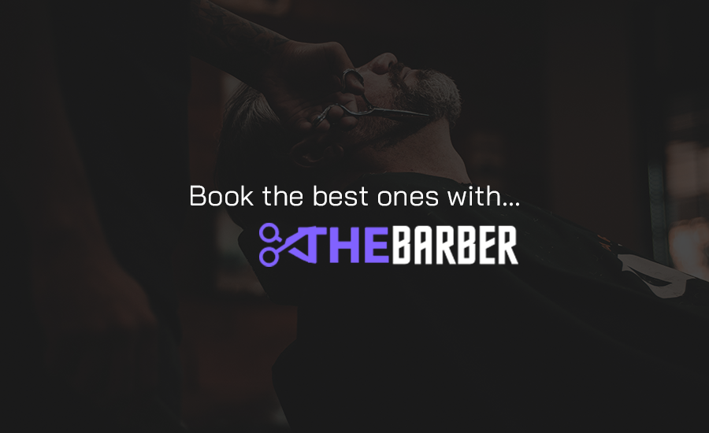

<div align="center" style="margin-bottom: 20px;">
  <div>
    
  </div>
  </br>
  <div align="center">
    
    
    
    
    
    
  </div>
</div>

## :memo: About project

**The Barber** is a marketplace designed to connect clients with barbershops. The app allows users to:

- Find barbershops and conveniently book services.
- Explore barbershops based on location and service type.
- View a list of their upcoming and past appointments.
- Check barbershop addresses and search by name or service type.

## ⚡ Technologies Used

- **Next.js**: React framework for building modern, dynamic user interfaces.
- **Prisma**: ORM for data modeling and management, making it easy to create and consume data.
- **PostgreSQL**: Relational database used to store barbershop, service, and appointment data.

This is a project in its initial phase, with significant potential for future enhancements. Several functionalities have already been implemented, with more to come.

Feel free to adjust it if necessary!



## :cyclone: Run this project

**Before starting, check the `.env.example` file and add your Google authentication keys. Then, create a database, preferably using PostgreSQL, and insert the connection string into the file. After completing these steps, you can run a seed to populate the database with mock data, if desired.**

```bash
# clone this repository
git clone https://github.com/jefferson1104/the-barber.git

# go to the folder
cd the-barber

# environment file database, google, auth secret
create and connect your database (postgreSQL)

# install dependencies
$ npm install

# run seed.ts
npx prisma db seed

# run app in local
$ npm run dev
```
